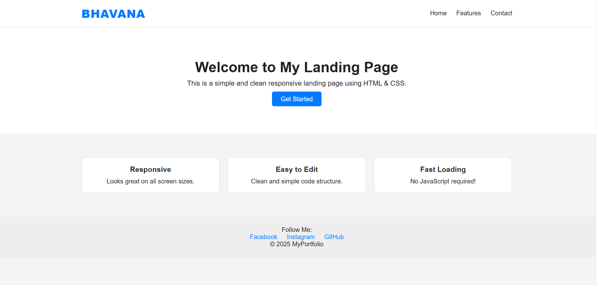

# 🌐 Responsive Landing Page

A modern and responsive landing page developed using HTML and CSS. The project focuses on creating a clean, attractive, and user-friendly interface that adapts to different screen sizes.

## 📸 Preview



## 🚀 Features

* Responsive design
* Modern UI layout
* Clean navigation
* Mobile-friendly interface
* Simple and lightweight

## 🛠️ Technologies Used

* HTML5
* CSS3

## 📂 Project Structure

```
Responsive-Landing-Page/
│── index.html
│── style.css
│── preview.png
└── README.md
```

## 💻 How to Run

1. Clone this repository.
2. Open `index.html` in any web browser.

## 🎯 Future Enhancements

* Add JavaScript animations
* Improve accessibility
* Include interactive sections
* Deploy using GitHub Pages

## 👩‍💻 Author

Bhavana Vandanam
